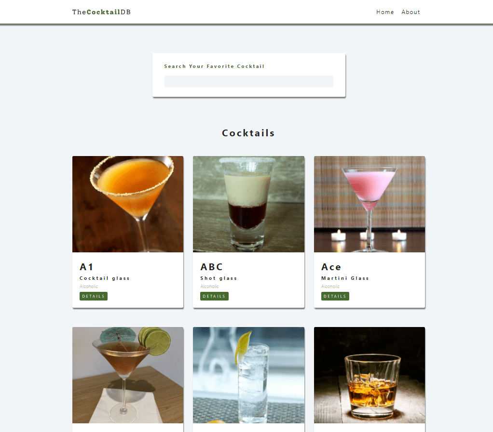

# Cocktails

## Screenshots

## Technologies Used:
- HTML
- CSS
- React.js
   - react-router-dom
   - useCallback
   - useContext
   - useEffect
   - useState
   - useRef

## How to use
- Clone the project
- Install Node Js (v16.13.1)
- Run `npm install` to current directory

## Run app
In the project directory, you can run:

`npm start`

Runs the app in the development mode.

Open http://localhost:3000 to view it in your browser.