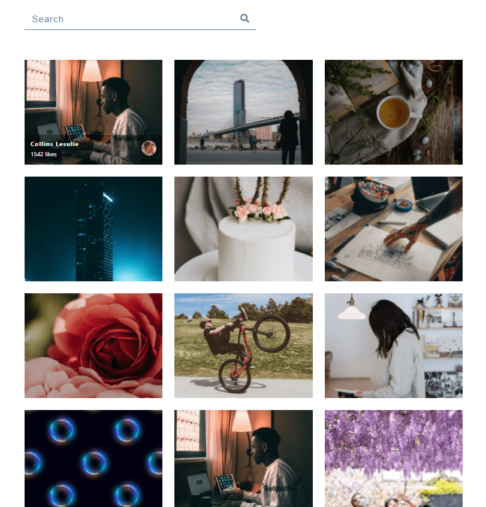

# Stock photos

## Screenshots

## Technologies Used:
- HTML
- CSS
- React.js
   - useState
   - useEffect
   - React Icons
   - Infinite scroll
   - Using .env file

## How to use
- Clone the project
- Install Node Js (v16.13.1)
- Run `npm install` to current directory
- Requires __*ACCESS_KEY*__ from __*api.unsplash.com*__ 
- Rename __*.env.sample*__ to __*.env*__ and insert access key

## Run app
In the project directory, you can run:

`npm start`

Runs the app in the development mode.

Open http://localhost:3000 to view it in your browser.